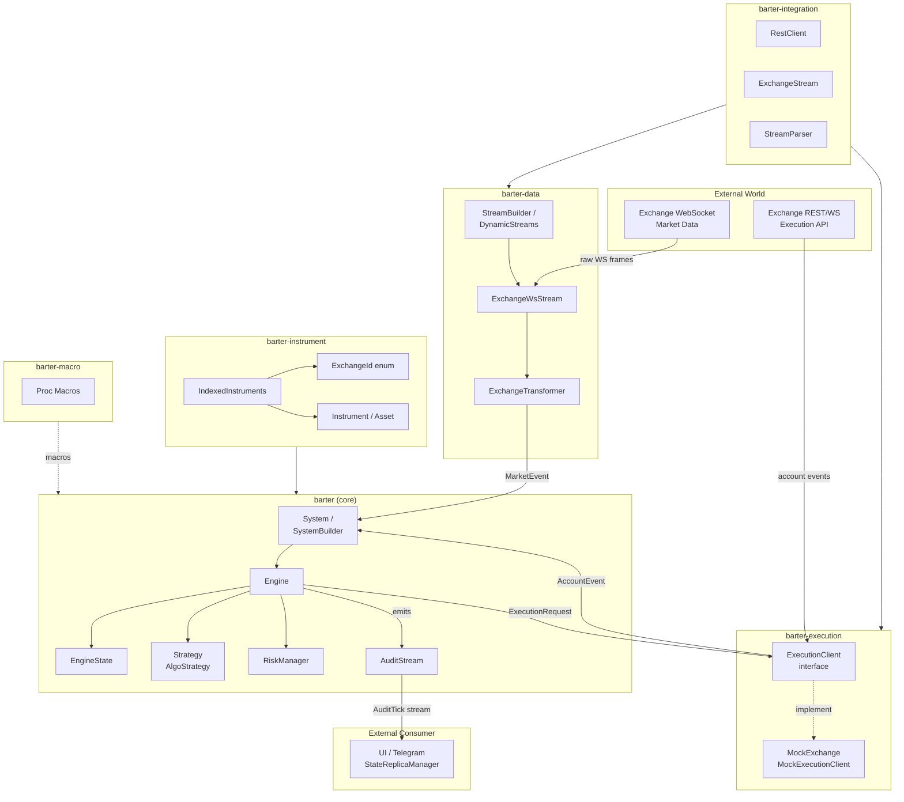
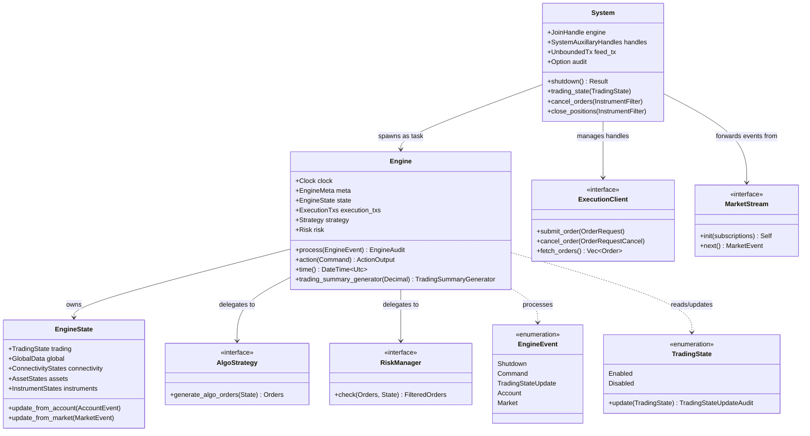

# Barter-rs — Architecture

## System Architecture Overview

The following diagram shows how the six crates collaborate at runtime. The `Engine` is the central processor; the other crates supply it with data, execution capacity, and typed domain objects.

---

## Trading Paradigm and Key Features

| Aspect | Approach |
|---|---|
| **Paradigm** | Event-driven, message-passing between async Tokio tasks |
| **Concurrency model** | Multi-threaded; each component (engine, market feed, execution) runs on its own Tokio task |
| **State strategy** | Centralised `EngineState` with indexed, cache-friendly data structures |
| **Latency target** | Microsecond-level processing on the hot path; no dynamic allocation in event loop |
| **Safety** | `#![forbid(unsafe_code)]` in every crate; fully Rust-safe |
| **Serialisation** | `serde` + `serde_json` throughout; all state types implement `Serialize`/`Deserialize` |
| **Strategy coupling** | Strategies are zero-size types parameterised on `Engine` — no trait objects on hot path |
| **Backtesting parity** | Same `Engine` code paths for live and backtesting; swap clock + execution client only |

---

## Core Components and Source References

### `Engine` — Trading Engine Processor

The `Engine<Clock, State, ExecutionTxs, Strategy, Risk>` struct is the central event processor. It implements `Processor<EngineEvent>` and dispatches incoming events to the appropriate sub-handlers.

- **Source**: `barter/src/engine/mod.rs:106-113` — struct definition and type parameters
- **Event dispatch**: `barter/src/engine/mod.rs:144-185` — `Processor::process` implementation
- **Command dispatch**: `barter/src/engine/mod.rs:207-238` — `Engine::action` method
- **Shutdown**: `barter/src/engine/mod.rs:188-200` — `SyncShutdown` implementation

### `EngineState` — Centralised State

All runtime trading state lives in a single `EngineState<GlobalData, InstrumentData>`. Fields are indexed using typed integer newtypes (`ExchangeIndex`, `AssetIndex`, `InstrumentIndex`) enabling O(1) lookups.

- **Source**: `barter/src/engine/state/mod.rs:60-78` — struct fields
- **Market update**: `barter/src/engine/state/mod.rs:177-193` — `update_from_market`
- **Account update**: `barter/src/engine/state/mod.rs:104-168` — `update_from_account`

### `System` and `SystemBuilder` — Top-Level Orchestrator

`System<Engine, Event>` wraps the running engine task, auxiliary handles, and provides the user-facing API for sending commands and controlling trading state.

- **Source**: `barter/src/system/mod.rs:38-54` — `System` struct
- **Shutdown**: `barter/src/system/mod.rs:62-73` — `System::shutdown`
- **Backtest shutdown**: `barter/src/system/mod.rs:94-124` — `System::shutdown_after_backtest`
- **Config**: `barter/src/system/config.rs:28-34` — `SystemConfig`

### `TradingState` — Algo Toggle

`TradingState` is a two-variant enum that gates algorithmic order generation. Transitions are recorded in `TradingStateUpdateAudit`.

- **Source**: `barter/src/engine/state/trading/mod.rs:15-19` — enum definition
- **Update logic**: `barter/src/engine/state/trading/mod.rs:26-53` — `TradingState::update`

### `barter-data` — Market Data Streaming

`MarketStream<Exchange, Instrument, Kind>` is the core async trait. Concrete streams are constructed via `StreamBuilder` or `DynamicStreams`. Each call to `subscribe()` opens a dedicated WebSocket connection.

- **Source**: `barter-data/src/lib.rs:178-195` — `MarketStream` trait
- **WS init**: `barter-data/src/lib.rs:217-280` — `ExchangeWsStream::init`
- **Ping scheduling**: `barter-data/src/lib.rs:356-376` — `schedule_pings_to_exchange`

### `barter-execution` — Order Execution

`ExecutionClient` trait abstracts live and mock exchange interactions. `MockExchange` provides a feature-rich paper-trading environment for backtesting on the same code path.

- **Source**: `barter-execution/src/lib.rs:62-69` — `AccountEvent` struct
- **Order module**: `barter-execution/src/order/` — order lifecycle types
- **Balance module**: `barter-execution/src/balance.rs` — `AssetBalance`

### `barter-instrument` — Domain Types

Core domain objects: `ExchangeId`, `Instrument`, `Asset`, `InstrumentKind` (Spot, Perpetual, Future, Option). `IndexedInstruments` provides the lookup table shared between all components.

- **Source**: `barter-instrument/src/lib.rs:44-51` — `Keyed<Key, Value>` generic wrapper
- **Exchange enum**: `barter-instrument/src/exchange.rs` — `ExchangeId` covering all venues
- **Index module**: `barter-instrument/src/index/` — `IndexedInstruments`

### `barter-integration` — Protocol Foundation

Low-level REST and WebSocket primitives used internally by `barter-data` and `barter-execution`. Exposes `RestClient`, `ExchangeStream`, and `StreamParser` trait.

- **Source**: `barter-integration/src/lib.rs:25-28` — crate overview
- **Protocol module**: `barter-integration/src/protocol/` — `StreamParser`, WS types
- **Stream module**: `barter-integration/src/stream/` — `ExchangeStream`

---

## Component Class Diagram

---

## See Also

- [workflow.md](workflow.md) — Event processing pipeline and data flow
- [state-management.md](state-management.md) — State machines and data model details
- [development.md](development.md) — Setup and configuration reference
