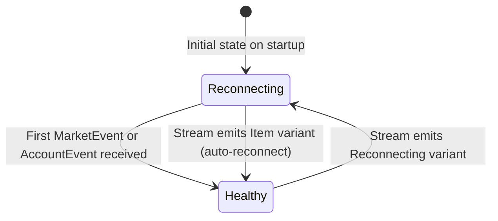

# Barter-rs — State Management

## Engine State Machine

The `Engine` operates as an implicit state machine gated on `TradingState`. The following diagram shows all valid state transitions for the two top-level modes and how connectivity events interact.

```mermaid
stateDiagram-v2
    [*] --> Disabled : SystemBuilder default

    Disabled --> Enabled : TradingStateUpdate(Enabled)
    Enabled --> Disabled : TradingStateUpdate(Disabled)
    Enabled --> Disabled : OnTradingDisabled hook fires

    state Enabled {
        [*] --> Healthy
        Healthy --> Reconnecting : MarketStreamEvent::Reconnecting\nor AccountStreamEvent::Reconnecting
        Reconnecting --> Healthy : MarketStreamEvent::Item\nor AccountStreamEvent::Item received
        Reconnecting --> Reconnecting : OnDisconnectStrategy fires\n(cancel orders / close positions)
    }

    Enabled --> Shutdown : EngineEvent::Shutdown
    Disabled --> Shutdown : EngineEvent::Shutdown
    Shutdown --> [*]
```

Source: `barter/src/engine/state/trading/mod.rs` — `TradingState` and `TradingStateUpdateAudit`

---

## `TradingState` Transitions Table

| Previous State | Update | New State | Side Effect |
|---|---|---|---|
| `Disabled` | `Enabled` | `Enabled` | — |
| `Enabled` | `Disabled` | `Disabled` | `OnTradingDisabled` strategy fires |
| `Enabled` | `Enabled` | `Enabled` | No-op (logged) |
| `Disabled` | `Disabled` | `Disabled` | No-op (logged) |

The `TradingStateUpdateAudit::transitioned_to_disabled()` helper returns `true` only when a genuine `Enabled → Disabled` transition occurs, avoiding spurious strategy calls.

Source: `barter/src/engine/state/trading/mod.rs:26-70`

---

## Connectivity State Machine

Each exchange has an independent `ConnectivityState` for its market data and account streams. These are tracked inside `ConnectivityStates`.



Source: `barter/src/engine/state/connectivity/` — `ConnectivityStates`, `ConnectivityState`, `Health`

---

## `EngineState` Data Model

`EngineState<GlobalData, InstrumentData>` is the single source of truth for all runtime state. Its fields use indexed data structures for O(1) access by typed integer keys.

```
EngineState
├── trading: TradingState                          (Enabled | Disabled)
├── global: GlobalData                             (user-extensible global state)
├── connectivity: ConnectivityStates
│   ├── health: Health                             (Healthy | Reconnecting)
│   └── exchanges: Vec<ExchangeConnectivity>
│       ├── market: ConnectivityState
│       └── account: ConnectivityState
├── assets: AssetStates
│   └── [AssetIndex] → AssetState
│       ├── asset: Asset
│       ├── balance: Option<Timed<Balance>>
│       └── statistics: TearSheetAssetGenerator
└── instruments: InstrumentStates<InstrumentData>
    └── [InstrumentIndex] → InstrumentState<InstrumentData>
        ├── instrument: Instrument
        ├── orders: OrderManager
        ├── position: Option<Position>
        └── data: InstrumentData               (user-extensible per-instrument data)
```

Source: `barter/src/engine/state/mod.rs:60-78`

---

## Key Data Models

### `EngineEvent`

The top-level input type processed by the `Engine`. Generic over market event kind and key types.

```rust
pub enum EngineEvent<MarketKind, ExchangeKey, AssetKey, InstrumentKey> {
    Shutdown(Shutdown),
    Command(Command<ExchangeKey, AssetKey, InstrumentKey>),
    TradingStateUpdate(TradingState),
    Account(AccountStreamEvent<ExchangeKey, AssetKey, InstrumentKey>),
    Market(MarketStreamEvent<InstrumentKey, MarketKind>),
}
```

Source: `barter/src/lib.rs:118-129`

### `AccountEvent`

Emitted by `ExecutionClient` for every private account update.

```rust
pub struct AccountEvent<ExchangeKey, AssetKey, InstrumentKey> {
    pub exchange: ExchangeKey,
    pub kind: AccountEventKind<...>,
}

pub enum AccountEventKind {
    Snapshot(AccountSnapshot),
    BalanceSnapshot(AssetBalance),
    OrderSnapshot(Keyed<InstrumentIndex, OrderSnapshot>),
    OrderCancelled(OrderResponseCancel),
    Trade(Trade),
}
```

Source: `barter-execution/src/lib.rs:62-69`

### `MarketEvent`

Normalised market data event shared across all exchange integrations.

```rust
pub struct MarketEvent<InstrumentKey, Kind> {
    pub time_exchange: DateTime<Utc>,
    pub time_received: DateTime<Utc>,
    pub exchange: ExchangeId,
    pub instrument: InstrumentKey,
    pub kind: Kind,          // PublicTrade | OrderBookL1 | OrderBookL2 | ...
}
```

Source: `barter-data/src/event.rs`

### `Position`

Tracks an open position for a single instrument, accumulating trade fills.

Source: `barter/src/engine/state/position.rs`

### `Sequence`

Monotonically increasing `u64` counter tracking the number of events the `Engine` has processed. Included in every `AuditTick` for ordering guarantees.

```rust
pub struct Sequence(pub u64);
impl Sequence {
    pub fn fetch_add(&mut self) -> Sequence { ... }
}
```

Source: `barter/src/lib.rs:165-180`

### `Timed<T>`

A generic wrapper pairing any value with a `DateTime<Utc>` timestamp. Used for balances, positions, and statistics.

```rust
pub struct Timed<T> {
    pub value: T,
    pub time: DateTime<Utc>,
}
```

Source: `barter/src/lib.rs:95-111`

### `IndexedInstruments`

The shared lookup table constructed at startup from `Vec<InstrumentConfig>`. Assigns `ExchangeIndex`, `AssetIndex`, and `InstrumentIndex` to every entity, enabling the O(1) state lookups used throughout `EngineState`.

Source: `barter-instrument/src/index/`

---

## Statistics and `TradingSummary`

After a trading session, `Engine::trading_summary_generator()` produces a `TradingSummaryGenerator` that can generate summaries bucketed by time period (`Daily`, `Monthly`, etc.).

Key metrics computed per instrument and globally:

| Metric | Module |
|---|---|
| PnL (realised + unrealised) | `barter/src/statistic/summary/pnl.rs` |
| Sharpe Ratio | `barter/src/statistic/summary/` |
| Sortino Ratio | `barter/src/statistic/summary/` |
| Max Drawdown | `barter/src/statistic/algorithm.rs` |
| Win/Loss ratio | `barter/src/statistic/summary/instrument.rs` |
| Asset TearSheet | `barter/src/statistic/summary/asset.rs` |

Source: `barter/src/statistic/` — `TradingSummaryGenerator`, `TearSheet`, `TradingSummary`

---

## Order Manager State

Per-instrument `OrderManager` tracks in-flight and confirmed orders through their lifecycle:

| Order State | Description |
|---|---|
| In-flight open | `ExecutionRequest::Open` sent, awaiting confirmation |
| Open | `AccountEvent::OrderSnapshot` received |
| In-flight cancel | `ExecutionRequest::Cancel` sent |
| Cancelled | `AccountEvent::OrderCancelled` received |
| Filled | `AccountEvent::Trade` received; position updated |

Source: `barter/src/engine/state/order/` — `OrderManager`, `InFlightRequestRecorder`

---

## See Also

- [architecture.md](architecture.md) — Component class diagram and crate overview
- [workflow.md](workflow.md) — Event lifecycle sequence diagram
- [development.md](development.md) — Configuration reference and troubleshooting
