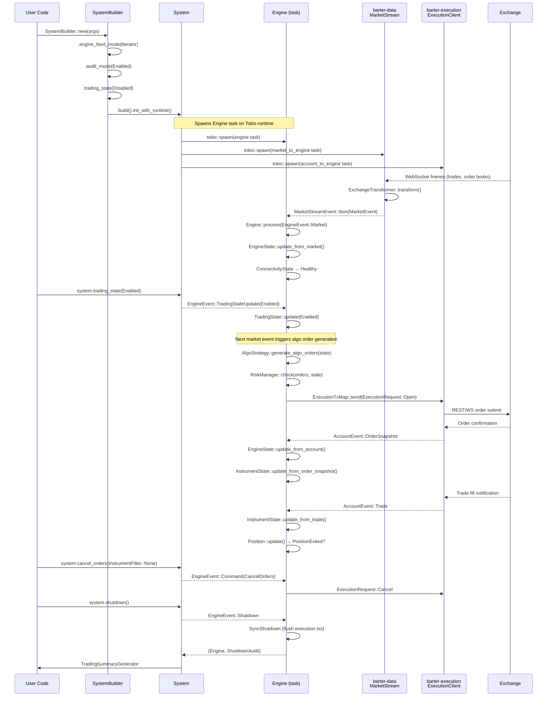
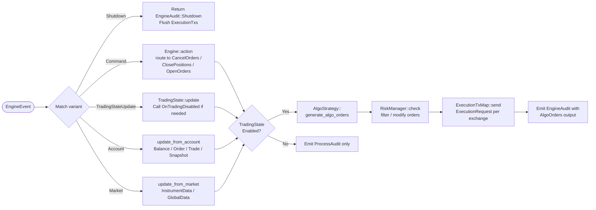

# Barter-rs — Workflow

## Processing Pipeline Sequence

The following sequence diagram traces the full lifecycle from system startup through market data receipt, strategy execution, order submission, and graceful shutdown.



---

## Data Flow

### Market Data Path

Raw exchange WebSocket frames flow through a multi-stage pipeline before reaching the `Engine`:

1. **Connection** — `Exchange::Subscriber::subscribe()` opens WebSocket and sends subscription payloads (`barter-data/src/lib.rs:235-241`).
2. **Buffered events** — Any events received during subscription handshake are buffered and replayed after initialisation (`barter-data/src/lib.rs:269-276`).
3. **Snapshot fetch** — For order book streams, an initial REST snapshot is fetched via `SnapshotFetcher` (`barter-data/src/lib.rs:204-213`).
4. **Transform** — `ExchangeTransformer::transform()` converts raw bytes to normalised `MarketEvent<InstrumentKey, Kind>` (`barter-data/src/transformer/`).
5. **Reconnect** — On disconnect, the stream emits `MarketStreamEvent::Reconnecting` which triggers `OnDisconnectStrategy` in the `Engine`.
6. **Engine update** — `EngineState::update_from_market()` updates connectivity, global data, and per-instrument data (`barter/src/engine/state/mod.rs:177-193`).

### Account / Execution Data Path

1. **Live execution** — `ExecutionClient` streams `AccountEvent`s (balances, order snapshots, trades) from the exchange.
2. **Mock execution** — `MockExecutionClient` simulates fills against historical market data for backtesting (same `AccountEvent` type).
3. **Routing** — `ExecutionRequest`s from the `Engine` are routed per-exchange via `ExecutionTxMap` (`barter/src/engine/execution_tx.rs`).
4. **State update** — `EngineState::update_from_account()` applies the event to asset balances, open orders, and instrument positions (`barter/src/engine/state/mod.rs:104-168`).

### Command Path

External processes (UI, Telegram bot, risk monitor) can inject `Command`s into the engine feed channel. The `System::send_*` family of methods provide the public API:

- `close_positions(InstrumentFilter)` → `Command::ClosePositions`
- `cancel_orders(InstrumentFilter)` → `Command::CancelOrders`
- `send_open_requests(orders)` → `Command::SendOpenRequests`
- `send_cancel_requests(requests)` → `Command::SendCancelRequests`

Source: `barter/src/system/mod.rs:126-168`

---

## Event Lifecycle

Every `EngineEvent` variant has a distinct lifecycle:



Source references:
- Event dispatch: `barter/src/engine/mod.rs:144-185`
- Algo order generation: `barter/src/engine/action/generate_algo_orders.rs`
- Order sending: `barter/src/engine/action/send_requests.rs`

---

## Audit Stream

When built with `AuditMode::Enabled`, the `Engine` emits an `AuditTick<EngineAudit>` after every event. Consumers use `StateReplicaManager` to maintain a read-only replica of `EngineState` outside the hot path — suitable for dashboards, alerting, or persistence.

```
Engine ──AuditTick──► unbounded channel ──► AuditStream consumer
                                              (StateReplicaManager / UI / DB)
```

Source: `barter/src/engine/audit/` — `AuditTick`, `Auditor`, `StateReplicaManager`

---

## See Also

- [architecture.md](architecture.md) — Crate structure and component diagram
- [state-management.md](state-management.md) — `EngineState` internals and state machines
- [development.md](development.md) — Building and running examples
